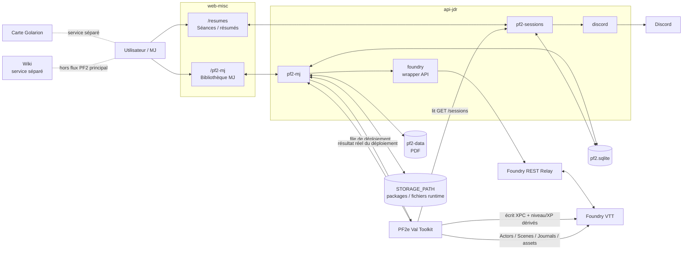

# RECAP — Architecture PF2 / JDR

> **État de référence : audit du 9 septembre 2026 — export `pf2-audit-20260909-131301`**
>
> Ce fichier décrit l’état courant observé dans le code exporté, la base `pf2.sqlite` et l’inventaire de `pf2-data`.
>
> **Règle de maintenance :** en cas de contradiction avec un ancien `README`, `INSTALL_*`, `CHANGELOG_*` ou document historique, le code courant et SQLite font foi.

---

## 1. Périmètre

Le système PF2 utile comprend :

- `web-misc`
  - `/pf2-mj` : bibliothèque MJ, catalogue, PNJ, lieux, régions, factions, événements, curation et préparation des scénarios ;
  - `/resumes` / `/résumés` : séances et résumés ;
- `api-jdr`
  - `pf2-mj` ;
  - `pf2-storage` ;
  - `pf2-sessions` ;
  - `foundry` ;
  - `discord` ;
- `pf2.sqlite` ;
- `pf2-data` pour la bibliothèque documentaire physique ;
- `STORAGE_PATH` pour les fichiers générés/runtime, notamment les packages de scénario ;
- le service indépendant **Foundry REST Relay** ;
- le module Foundry **PF2e Val Toolkit** ;
- Foundry VTT ;
- Discord ;
- la carte de Golarion, application séparée ;
- le wiki, service séparé actuellement hors du flux PF2 principal.

Ne font pas partie du cœur PF2-MJ documenté ici :

- `apps/admin-jdr/` ;
- `libs/jdr/` ;
- `apps/web-misc/src/jdr/` ;
- `apps/web-misc/src/pf2/` ;
- Year Diary.

---

## 2. Vue d’ensemble



---

## 3. Sources de vérité

### 3.1 Données métier PF2

La source de vérité métier est **`pf2.sqlite`**.

Elle contient notamment :

- catalogue campagnes/scénarios ;
- PNJ ;
- lieux ;
- régions ;
- factions ;
- événements ;
- curation MJ ;
- séances ;
- relations scénario ↔ entités ;
- métadonnées de bibliothèque ;
- packages intégrés ;
- état des déploiements Foundry.

Les JSON sous `apps/web-misc/src/pf2-mj/data` sont des seeds, rapports, exports ou données historiques. Ils ne doivent pas redevenir une source runtime concurrente de SQLite.

### 3.2 Fichiers documentaires physiques

La source de vérité physique des PDF est `PF2_LIBRARY_ROOT`, qui pointe vers `pf2-data` sur le mini-PC.

SQLite stocke les chemins, métadonnées et associations, pas le contenu lourd des PDF.

### 3.3 Fichiers runtime/générés

`STORAGE_PATH` est distinct de `pf2-data`.

Il sert notamment à :

```text
STORAGE_PATH/
├── portraits/
├── illustrations/
├── maps/
├── documents/
│   └── scenario-packages/
└── generated-downloads/
```

Les packages de scénario intégrés sont donc stockés sous :

```text
STORAGE_PATH/documents/scenario-packages/<scenarioId>/v<version>.zip
```

Cela explique qu’un audit de `pf2-data` puisse afficher `ZIP: 0` alors que SQLite possède déjà des packages intégrés et déployés.

### 3.4 Foundry

Foundry reste la source de vérité pour les objets mécaniques/visuels réellement présents dans le monde :

- Actors ;
- Scenes ;
- Journals ;
- Tokens ;
- état mécanique PF2e.

Un PNJ métier narratif peut être lié à un Actor par `foundryActorUuid`.

Les Actors narratifs importés par le Toolkit utilisent :

```text
flags.pf2e-val-toolkit.npcId
```

### 3.5 XPC

L’historique source de l’XPC vient des séances de `pf2.sqlite`.

La valeur matérialisée sur un PJ Foundry est :

```text
flags.pf2e-val-toolkit.xpc
```

---

## 4. État SQLite au 9 septembre 2026

| Table / type | Nombre |
|---|---:|
| `pf2_catalogue_entity` | 291 |
| `pf2_library_asset` | 479 |
| `pf2_record` | 728 |
| `pf2_session` | 7 |
| `pf2_scenario_npc` | 112 |
| `pf2_scenario_relation` | 90 |
| `pf2_scenario_dependency` | 5 |
| `pf2_scenario_package` | 7 |
| `pf2_scenario_deployment` | 7 |
| `pf2_media` | 0 |
| migrations appliquées | 16 |

Répartition de `pf2_record` :

| kind | Nombre |
|---|---:|
| `pnj` | 244 |
| `lieu` | 75 |
| `region` | 56 |
| `faction` | 69 |
| `evenement` | 30 |
| `scenario` | 250 |
| `catalogue` | 1 |
| `curation` | 1 |
| `geography-config` | 1 |
| `foundry-actor-cache` | 1 |

Répartition observée des scopes métier :

| kind | global | scenario |
|---|---:|---:|
| PNJ | 181 | 63 |
| lieux | 51 | 24 |
| régions | 55 | 1 |
| factions | 60 | 9 |
| événements | 25 | 5 |

Le passage à des entités réellement propres aux scénarios est donc désormais effectif.

---

## 5. Persistance SQLite

### 5.1 `pf2_record`

Référentiel générique pour :

- `pnj`
- `lieu`
- `region`
- `faction`
- `evenement`
- anciennes copies `scenario`
- `curation`
- configuration géographique
- cache Actors Foundry

Une entité peut être globale :

```json
{ "scope": "global" }
```

ou propre à un scénario :

```json
{
  "scope": "scenario",
  "ownerScenarioId": "id-du-scenario"
}
```

### 5.2 `pf2_catalogue_entity`

Source runtime du catalogue actuel.

Répartition observée :

- 250 `entry` ;
- 14 `collection` ;
- 11 `arc` ;
- 10 `thread` ;
- 5 `section` ;
- 1 `meta`.

Le frontend continue de projeter le catalogue dans ses structures `Container`, `PlayableUnit`, `Component` et `CatalogueDocument`.

### 5.3 `pf2_library_asset`

479 ressources observées, toutes de type PDF dans cet audit.

La table stocke notamment :

- chemin ;
- nom ;
- type ;
- cible ;
- rôle ;
- langue ;
- variante ;
- complétude ;
- état d’association ;
- présence sur disque ;
- score et preuves de rapprochement.

### 5.4 Relations scénarios

Les relations ne sont plus vides :

```text
pf2_scenario_npc      : 112
pf2_scenario_relation : 90
pf2_scenario_dependency : 5
```

`pf2_scenario_relation` couvre :

- lieu ;
- région ;
- faction ;
- événement.

### 5.5 Packages et déploiements

Le pipeline est maintenant réellement utilisé :

```text
pf2_scenario_package    : 7
pf2_scenario_deployment : 7
```

Les 7 packages sont en état `deployed` et les 7 déploiements observés sont en `success`.

---

## 6. Catalogue, campagnes, scénarios et PDF

### 6.1 Modèle runtime

Le frontend distingue :

- **Container** : campagne, collection, saison, série ;
- **PlayableUnit** : unité réellement jouable ;
- **Component** : guide, compilation, carte, ressource, traduction ;
- **CatalogueDocument** : document physique.

Seuls les `PlayableUnit` sont proposés comme parties à jouer.

### 6.2 Scanner

`POST /api/pf2-mj/local-scan`

Le scanner :

1. parcourt `PF2_LIBRARY_ROOT` ;
2. ignore notamment `.DS_Store`, `._*` et `__MACOSX` ;
3. détecte les PDF ;
4. compare les chemins au catalogue ;
5. réconcilie déplacements/noms ;
6. détecte certaines traductions ;
7. détecte les PDF d’information ;
8. met à jour l’inventaire avec `apply=true`.

Audit physique :

```text
PDF : 479
ZIP dans pf2-data : 0
```

### 6.3 PDF partagé par plusieurs unités

Le cas « un PDF physique satisfait plusieurs unités logiques » est désormais pris en charge dans le code de résolution des ressources.

Un même `fileId` peut être lié à plusieurs `parts`, et `libraryAssetsForScenario()` sait restituer le même PDF comme ressource directe de plusieurs aventures.

Le cas structurel signalé lors de l’audit du 4 septembre n’est donc plus à garder comme dette prioritaire.

---

## 7. Curation

La curation courante utilise un schéma V4 avec des axes séparés, notamment :

- `preparationStatus`
- `playStatus`
- `excluded`
- `excludedReason`

Les anciens `progress` V3 sont migrés vers ces axes.

Les statuts d’exclusion atomiques gérés dans le code sont :

```text
active
later
rejected
```

Lorsqu’un conteneur/campagne reçoit `later` ou `rejected`, le backend applique désormais le statut aux descendants conteneurs/jouables.

La logique de cascade « campagne écartée/plus tard → scénarios descendants » est donc présente dans le code courant.

---

## 8. PNJ et entités métier

### 8.1 PNJ narratifs

Un PNJ métier vit dans :

```text
pf2_record
kind = "pnj"
```

Son identifiant est stable.

**Ne jamais fusionner deux PNJ sur le nom seul.**

### 8.2 Global ou propre au scénario

Les deux scopes sont désormais réellement utilisés.

Pour un nouveau PNJ de package sans `npcId`, l’identifiant déterministe reste :

```text
<scenarioId>--<key>
```

### 8.3 PNJ vs Actor mécanique

Conserver la séparation :

**PNJ métier narratif**

- personnage nommé ;
- identité persistante ;
- utile au référentiel MJ ;
- peut être réutilisé entre scénarios.

**Actor mécanique**

- monstre ;
- garde anonyme ;
- figurant ;
- statblock nécessaire à une rencontre.

Un Actor mécanique ne doit pas être promu automatiquement en PNJ métier.

---

## 9. Portraits PNJ

Le code courant de `Pf2MjService` utilise encore comme chemin canonique actif :

```text
FOUNDRY_ASSETS_ROOT/
└── portraits/
    └── pnj/
        └── <id-pnj>.webp
```

Le chemin stocké dans le PNJ est :

```text
assets/l7r/portraits/pnj/<id-pnj>.webp
```

L’API sert les portraits via :

```text
GET /api/pf2-mj/portraits/:filename
```

Si `foundryActorUuid` est présent, le Relay peut mettre à jour l’Actor pour pointer vers ce même asset.

### Dette documentaire

`docs/wiki-foundry.md` décrit au contraire un stockage via `STORAGE_PATH/portraits/` et `pf2_media`.

Cette documentation est en contradiction avec le code runtime exporté :

- `pf2_media` existe mais contient 0 ligne ;
- `Pf2MjService` écrit actuellement directement sous `FOUNDRY_ASSETS_ROOT/portraits/pnj`.

Le code courant doit être considéré comme canonique jusqu’à décision explicite de migration.

---

## 10. Foundry REST Relay

Deux couches restent distinctes.

### 10.1 Service Relay indépendant

Configuration :

```text
FOUNDRY_REST_URL
FOUNDRY_REST_API_KEY
```

Le wrapper Nest utilise le Relay pour :

- lister/lire des Actors ;
- récupérer les candidats PNJ ;
- créer un placeholder ;
- synchroniser un portrait ;
- lire/modifier XPC ;
- effectuer les opérations nécessaires au lien avec Foundry.

### 10.2 Toolkit

Version observée du module :

```text
PF2e Val Toolkit 0.33.0
```

Il contient désormais, entre autres :

- XPC de carrière ;
- importeur de scénarios ;
- navigateur d’actions/conditions ;
- synchronisation portrait/token ;
- outils de mouvement/combat ;
- création rapide de scène de combat.

---

## 11. Séances et résumés

### 11.1 Modèle

`pf2_session` contient désormais notamment :

- `sessionNumber`
- `date` : date réelle de la séance ;
- `inGameStartDate`
- `inGameEndDate`
- `title`
- `participants`
- auteurs résumé court/long ;
- `sessionXp`
- `shortSummaryXp`
- `longSummaryXp`
- `longSummaryUrl`
- `shortSummary`
- `discordMessageId`
- `published`

### 11.2 Brouillon / publication

La création d’une séance force maintenant :

```text
published = false
```

Une sauvegarde classique ne synchronise pas Discord.

La publication se fait explicitement via :

```text
POST /api/pf2-mj/sessions/:id/publish
```

Si un résumé court doit être publié mais que Discord ne confirme ni création ni mise à jour du message, le backend remet la séance en brouillon et renvoie une erreur.

L’interface `/resumes` expose :

- Enregistrer ;
- Publier ;
- Remettre en brouillon.

### 11.3 État observé

7 séances sont présentes dans SQLite.

Les sept lignes exportées sont actuellement marquées `published = true`.

### 11.4 Anomalie de donnée à corriger

La séance 5 contient actuellement :

```text
inGameEndDate = 0720-04-14
```

alors que les autres dates en jeu sont dans l’année 4720.

Le récap ne corrige pas automatiquement cette valeur : elle doit être vérifiée dans la donnée source.

---

## 12. XPC

Pour un Actor :

```text
XPC =
  somme(sessionXp des séances où il est participant)
+ somme(shortSummaryXp lorsqu’il est auteur du résumé court)
+ somme(longSummaryXp lorsqu’il est auteur du résumé long)
```

Flag canonique :

```text
flags.pf2e-val-toolkit.xpc
```

### Courbe historique canonique

| Niveau | XPC cumulée |
|---:|---:|
| 1 | 0 |
| 2 | 300 |
| 3 | 900 |
| 4 | 2 700 |
| 5 | 6 500 |
| 6 | 14 000 |
| 7 | 23 000 |
| 8 | 34 000 |
| 9 | 48 000 |
| 10 | 65 000 |
| 11 | 84 000 |
| 12 | 105 000 |
| 13 | 127 000 |
| 14 | 151 000 |
| 15 | 177 000 |
| 16 | 205 000 |
| 17 | 236 000 |
| 18 | 271 000 |
| 19 | 311 000 |
| 20 | 356 000 |

Le niveau est le plus haut palier inférieur ou égal à XPC.

L’XP PF2e dans le niveau courant est une projection proportionnelle entre le palier courant et le suivant.

**Ne jamais réintroduire :**

```text
niveau = floor(XPC / 1000) + 1
XP PF2 = XPC % 1000
```

---

## 13. Discord

Discord reste optionnel : une indisponibilité du bot ne doit pas empêcher l’API principale de démarrer.

### 13.1 Résumés

Un résumé publié est synchronisé vers le canal configuré :

- création si aucun message associé ;
- mise à jour si `discordMessageId` existe ;
- création d’un thread de commentaires ;
- sauvegarde de l’identifiant du message.

Les brouillons ne sont pas synchronisés.

### 13.2 Commandes observées

```text
/ping
/rec
/recap
/new-game
/finish-game
```

### 13.3 `/new-game`

Le flux actuel :

1. reçoit de 1 à 6 joueurs Discord ;
2. associe les joueurs à leurs PJ Foundry ;
3. calcule les disponibilités temporelles à partir des séances déjà publiées ;
4. permet de choisir les PJ puis une date de début ;
5. crée automatiquement le prochain numéro de séance ;
6. crée un **brouillon** SQLite avec :
   - participants ;
   - `inGameStartDate` ;
   - `published = false` ;
7. propose ensuite de publier séparément l’annonce Discord ;
8. demande de compléter puis publier le résumé dans l’application MJ.

### 13.4 `/finish-game`

Permet de terminer une mission avec :

- XP par PJ ;
- numéro de résumé facultatif ;
- date de fin en jeu explicite ou durée en jours.

La commande met à jour notamment :

```text
sessionXp
inGameEndDate
```

---

## 14. Packages de scénario

### 14.1 Pipeline

Le workflow est désormais réellement opérationnel :

```text
package ZIP
→ intégration application MJ
→ création/réutilisation entités métier
→ relations scénario ↔ entités
→ stockage sous STORAGE_PATH
→ demande de déploiement
→ Toolkit Foundry claim
→ import Foundry
→ résultat réel
→ package marqué deployed
```

### 14.2 Format courant

Pour les nouveaux packages produits par le pipeline IA :

```json
{
  "packageFormatVersion": 4,
  "packageVersion": 1,
  "scenario": {
    "id": "scenario-stable",
    "name": "Nom"
  },
  "actors": [],
  "npcs": [],
  "maps": []
}
```

`packageFormatVersion: 4` est le format recommandé/courant.

Les anciens packages restent lisibles en compatibilité legacy.

### 14.3 Actors

Trois types :

```text
reference
custom
narrative
```

Pour un `reference` produit par le pipeline IA, un UUID exact vérifié dans l’index Foundry est requis par la validation actuelle.

Les `custom` V4 utilisent un `data.mode` explicite, notamment `statblock` ou, dans les cas permis, `narrative`.

### 14.4 Cartes et scènes

Le format V4 valide aussi les informations de grille des cartes.

Le Toolkit peut importer :

- Actors ;
- Scenes ;
- Journals ;
- assets.

### 14.5 Déploiement

La file garde les états :

```text
pending
→ claimed
→ success
```

ou :

```text
pending
→ claimed
→ failed
```

Des opérations de `reset` sont également prises en charge dans la structure de déploiement actuelle.

Le succès du Toolkit reste la seule confirmation valide d’un déploiement réussi.

### 14.6 État réel au 9 septembre

Packages intégrés et déployés :

- `agents-of-edgewatch-adventure-1`
- `agents-of-edgewatch-adventure-2`
- `agents-of-edgewatch-adventure-3`
- `agents-of-edgewatch-adventure-4`
- `agents-of-edgewatch-adventure-5`
- `agents-of-edgewatch-adventure-6`
- `pfs-season-1-1-01`

Tous sont en version package 1 et marqués `deployed`.

Les 7 déploiements correspondants sont en `success`.

La campagne **Agents d’Absalom** a donc servi de validation réelle du pipeline complet, avec six aventures déployées.

---

## 15. Préparation de campagne / génération assistée

Le backend possède maintenant un `ScenarioPreparationService` plus avancé.

Il peut préparer le contexte nécessaire à la génération d’un package à partir de :

- curation ;
- registre métier ;
- registre des packages ;
- catalogue ;
- ressources disponibles ;
- index/références Foundry.

Il contrôle notamment les versions de package et refuse d’écraser silencieusement une vN différente par une autre vN.

Principe à conserver :

```text
registre courant
+ PDF / informations source
+ références Foundry vérifiées
→ package V4
→ import application
→ déploiement Foundry
```

---

## 16. Carte de Golarion

Application distincte :

```text
apps/web-golarion-map
```

Documentation connue :

- port local par défaut : `4204` ;
- `/pj` : vue joueur ;
- `/mj` : vue MJ ;
- ressources lourdes via `GOLARION_MAP_ASSETS_DIR` ;
- URL publique : `https://map.l7r.fr`.

Elle reste hors du flux principal de persistance PF2-MJ tant qu’aucune intégration explicite avec SQLite n’est mise en place.

---

## 17. Wiki

La documentation du dépôt décrit encore un service **XWiki** indépendant sous Docker :

```text
npm run wiki
npm run wiki:up
npm run wiki:down
npm run wiki:logs
```

Port documenté :

```text
4205
```

URL publique documentée :

```text
https://wiki.l7r.fr
```

Le wiki n’est toujours pas intégré au flux PF2 principal dans le code exporté.

### Point à clarifier

L’interface montrée en pratique présente des éléments typiques de MediaWiki, alors que la documentation versionnée parle de XWiki.

Ce récap conserve donc uniquement le fait certain : **le wiki est un service séparé et n’est pas actuellement synchronisé avec `pf2_session`**.

Avant d’implémenter une synchronisation résumés ↔ wiki, il faut confirmer le moteur réellement utilisé.

---

## 18. Dettes et anomalies connues

### Priorité haute

#### A. Wiki ↔ résumés

Le wiki et `pf2_session` ne se parlent toujours pas.

La direction recommandée est :

- SQLite reste la vérité structurée ;
- le wiki contient les résumés longs / contenu narratif ;
- une page d’index wiki peut être générée depuis SQLite ;
- éviter autant que possible une double vérité éditable en synchronisation bidirectionnelle.

#### B. Date en jeu de la séance 5

Valeur observée :

```text
0720-04-14
```

À contrôler/corriger dans SQLite via l’application ou l’API.

#### C. Documentation portraits contradictoire

`docs/wiki-foundry.md` et le code runtime ne décrivent pas le même stockage.

Il faut soit :

- aligner la documentation sur le code actuel ;
- soit terminer réellement une migration vers `STORAGE_PATH`/`pf2_media`.

### Priorité moyenne

#### D. Deux représentations des scénarios

La base contient encore :

```text
pf2_record kind=scenario : 250
pf2_catalogue_entity entry : 250
```

Le catalogue principal utilise `pf2_catalogue_entity`, mais l’ancienne représentation reste présente.

Ne pas la supprimer sans audit des fallbacks.

#### E. XPC wrapper Relay

Le wrapper Nest doit rester aligné avec la règle canonique : l’XPC provient de l’historique des séances et de la courbe historique, pas d’une reconstruction arbitraire depuis niveau/XP PF2e.

### Éléments sortis des dettes précédentes

- PDF partagé entre plusieurs unités : prise en charge présente dans le code actuel ;
- relations scénario ↔ PNJ : désormais peuplées ;
- relations scénario ↔ lieux/régions/factions/événements : désormais peuplées ;
- packages : pipeline désormais alimenté ;
- déploiements Foundry : plusieurs succès réels observés ;
- propagation `later/rejected` depuis une campagne : logique de cascade présente.

---

## 19. Règles à ne pas réintroduire

### XPC

Ne jamais utiliser :

```text
niveau = floor(XPC / 1000) + 1
XP PF2 = XPC % 1000
```

### PNJ

Ne jamais fusionner sur le nom seul.

### Monstres

Ne pas transformer automatiquement un monstre, garde anonyme ou figurant mécanique en PNJ métier.

### JSON historiques

Ne pas remettre un JSON historique comme vérité runtime parallèle à SQLite.

### Déploiement Foundry

Ne pas marquer un package comme déployé tant que le Toolkit n’a pas renvoyé un succès réel.

### Séances

Ne pas synchroniser automatiquement un brouillon vers Discord : la publication est explicite.

---

## 20. Fichiers et répertoires importants

### Backend

```text
apps/api-jdr/src/pf2-mj/
apps/api-jdr/src/pf2-storage/
apps/api-jdr/src/pf2-sessions/
apps/api-jdr/src/foundry/
apps/api-jdr/src/discord/
```

### Frontend

```text
apps/web-misc/src/pf2-mj/
apps/web-misc/src/resumes/
```

### Foundry

```text
pf2e-val-toolkit/
```

### Données

```text
pf2.sqlite
pf2-data/
STORAGE_PATH/
```

### Services indépendants

```text
support/foundry-rest/
support/xwiki/
apps/web-golarion-map/
```

---

## 21. Variables importantes

```text
SQLITE_PATH
PF2_LIBRARY_ROOT
PF2_DATA_ROOT
STORAGE_PATH
FOUNDRY_ASSETS_ROOT
FOUNDRY_REST_URL
FOUNDRY_REST_API_KEY
FOUNDRY_XPC_FLAG_SCOPE
DISCORD_BOT_TOKEN
DISCORD_CLIENT_ID
DISCORD_GUILD_ID
DISCORD_SUMMARIES_CHANNEL_NAME
GOLARION_MAP_ASSETS_DIR
```

Le scope XPC doit rester aligné avec :

```text
pf2e-val-toolkit
```

---

## 22. Export d’audit pour mettre à jour ce RECAP

Le script de référence est :

```text
export-pf2.sh
```

Lancement :

```bash
chmod +x export-pf2.sh
./export-pf2.sh
```

Il produit dans `~/services` un fichier du type :

```text
pf2-audit-YYYYMMDD-HHMMSS.zip
```

L’export contient notamment :

- `pf2.sqlite` ;
- backend PF2 utile ;
- frontend PF2 MJ et résumés ;
- Toolkit Foundry ;
- configs/docs utiles ;
- inventaire de `pf2-data` ;
- diagnostics Git ;
- schéma/résumé SQLite.

Il n’inclut volontairement pas :

- `.env` ;
- `node_modules` ;
- le contenu binaire des PDF ;
- les applications hors périmètre.

### Procédure de mise à jour

Après modification structurelle :

1. lancer `export-pf2.sh` ;
2. conserver le ZIP d’audit ;
3. comparer code + SQLite + inventaires avec ce fichier ;
4. mettre à jour les nombres et flux ;
5. déplacer les anciennes dettes résolues ;
6. ajouter les nouvelles anomalies observées ;
7. vérifier explicitement les sections séances, packages, portraits et XPC.

---

## 23. Ordre de travail recommandé à partir de maintenant

1. Corriger la date en jeu anormale de la séance 5.
2. Décider précisément de l’intégration wiki ↔ résumés.
3. Confirmer le moteur wiki réellement utilisé et documenter son API.
4. Garder SQLite comme vérité structurée des séances.
5. Utiliser le wiki comme contenu narratif / résumés longs et éventuellement vue générée des séances.
6. Aligner la documentation portraits avec le comportement runtime réel.
7. Continuer les campagnes/scénarios sélectionnés avec le pipeline V4 maintenant validé.
8. Enrichir progressivement les relations scénario ↔ entités.
9. Nettoyer la duplication `pf2_record scenario` seulement après audit complet des fallbacks.
10. Régénérer régulièrement un audit avec `export-pf2.sh` pour maintenir ce fichier comme manuel d’état courant.
