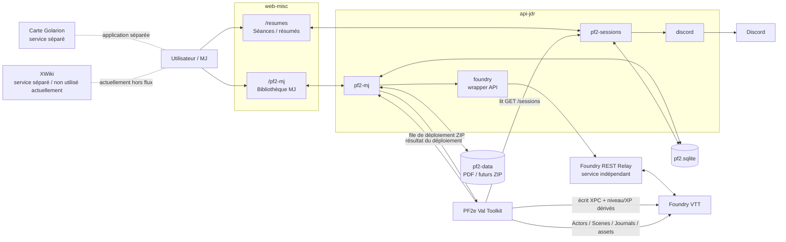

# RECAP — Architecture PF2 / JDR

> **État de référence : audit du 4 septembre 2026**
>
> Ce fichier décrit l’état actuel du système PF2/JDR observé dans le code, la base `pf2.sqlite` et l’inventaire de `pf2-data`.
>
> **Règle de maintenance :** en cas de contradiction avec un ancien `README`, `INSTALL_*`, `CHANGELOG_*` ou autre document historique, le code courant et la SQLite font foi. Toute modification structurelle importante doit mettre à jour ce fichier.

---

## 1. Périmètre

Le système PF2 utile est composé de :

- l’application web `web-misc`, notamment :
  - `/pf2-mj` : bibliothèque MJ, catalogue, PNJ, lieux, régions, factions, événements, curation, préparation des scénarios ;
  - `/resumes` / `/résumés` : gestion des séances et résumés ;
- l’API NestJS `api-jdr`, notamment :
  - `pf2-mj` ;
  - `pf2-storage` ;
  - `pf2-sessions` ;
  - `foundry` ;
  - `discord` ;
- la base `pf2.sqlite` ;
- la bibliothèque physique `pf2-data` ;
- le service indépendant **Foundry REST Relay** ;
- le module Foundry **PF2e Val Toolkit** ;
- Foundry VTT ;
- Discord ;
- la carte de Golarion, application séparée ;
- XWiki, service séparé actuellement hors du flux PF2 principal.

Ne font **pas** partie du cœur PF2-MJ documenté ici :

- `apps/admin-jdr/` ;
- `libs/jdr/` ;
- `apps/web-misc/src/jdr/` ;
- `apps/web-misc/src/pf2/` ;
- Year Diary.

---

## 2. Vue d’ensemble



---

## 3. Sources de vérité

### 3.1 Données métier PF2

La source de vérité métier est **`pf2.sqlite`**.

Elle contient notamment :

- catalogue campagnes/scénarios ;
- PNJ ;
- lieux ;
- régions ;
- factions ;
- événements ;
- curation MJ ;
- séances ;
- relations scénario ↔ entités ;
- métadonnées de bibliothèque ;
- état des packages ZIP ;
- état des déploiements Foundry.

Les anciens JSON sous `apps/web-misc/src/pf2-mj/data` sont des seeds, rapports, exports ou données historiques. Ils ne doivent pas redevenir une source runtime concurrente de SQLite.

### 3.2 Fichiers physiques

La source de vérité physique est **`PF2_LIBRARY_ROOT`**, qui pointe sur `pf2-data` sur le mini-PC.

On y trouve :

- PDF ;
- cartes PDF ;
- guides ;
- traductions ;
- documents d’information ;
- futurs ZIP de scénarios / ressources Foundry.

SQLite ne stocke pas les gros fichiers eux-mêmes : elle stocke les chemins, métadonnées et associations.

### 3.3 Foundry

Foundry reste la source de vérité pour les objets mécaniques/visuels réellement présents dans le monde :

- Actors ;
- Scenes ;
- Journals ;
- Tokens ;
- état mécanique PF2e.

Les PNJ narratifs de l’application MJ ont un identifiant métier stable. Quand un Actor Foundry correspond à un PNJ, le lien stable côté référentiel est `foundryActorUuid`, et les Actors narratifs importés par le Toolkit utilisent :

```text
flags.pf2e-val-toolkit.npcId
```

### 3.4 XPC

L’historique permettant de recalculer l’XPC vient des séances enregistrées dans `pf2.sqlite`.

La valeur XPC matérialisée sur un PJ Foundry est :

```text
flags.pf2e-val-toolkit.xpc
```

Le Toolkit lit les séances via l’API et recalcule l’XPC des PJ.

---

## 4. État SQLite observé lors de l’audit

Base auditée : `pf2.sqlite`.

| Table / type | Nombre |
|---|---:|
| `pf2_catalogue_entity` | 291 |
| `pf2_library_asset` | 377 |
| `pf2_record` | 590 |
| `pf2_session` | 6 |
| `pf2_scenario_npc` | 0 |
| `pf2_scenario_relation` | 0 |
| `pf2_scenario_package` | 0 |
| `pf2_scenario_deployment` | 0 |
| `pf2_media` | 0 |
| migrations appliquées | 11 |

Répartition actuelle de `pf2_record` :

| kind | Nombre |
|---|---:|
| `pnj` | 145 |
| `lieu` | 51 |
| `region` | 55 |
| `faction` | 60 |
| `evenement` | 25 |
| `scenario` | 250 |
| `catalogue` | 1 |
| `curation` | 1 |
| `geography-config` | 1 |
| `foundry-actor-cache` | 1 |

À la date de l’audit, aucun PNJ/lieu/région/faction/événement n’est encore réellement `scope: "scenario"`.

---

## 5. Structure de la persistance SQLite

### 5.1 `pf2_record`

Référentiel générique pour :

- `pnj`
- `lieu`
- `region`
- `faction`
- `evenement`
- anciennes copies `scenario`
- `curation`
- configuration géographique
- cache Actors Foundry

Les entités métier peuvent avoir :

```json
{
  "scope": "global"
}
```

ou :

```json
{
  "scope": "scenario",
  "ownerScenarioId": "id-du-scenario"
}
```

Les données `scope: scenario` peuvent être masquées automatiquement si leur scénario propriétaire est écarté.

### 5.2 `pf2_catalogue_entity`

Source runtime du catalogue actuel.

Le snapshot reconstruit par l’API contient actuellement un schéma V2 :

- `entries`
- `collections`
- `sections`
- `arcs`
- `narrativeThreads`

Le frontend `catalogue.ts` transforme ensuite cette structure en vue runtime V3 :

- `Container`
- `PlayableUnit`
- `Component`
- `CatalogueDocument`

### 5.3 `pf2_library_asset`

Métadonnées des ressources physiques :

- chemin ;
- nom ;
- type (`pdf`, futur `zip`) ;
- cible ;
- langue ;
- variante ;
- complétude ;
- état d’association ;
- présence sur disque ;
- métadonnées de scan.

### 5.4 Relations scénarios

Deux tables spécialisées :

```text
pf2_scenario_npc
```

pour scénario ↔ PNJ, et :

```text
pf2_scenario_relation
```

pour scénario ↔ :

- lieu ;
- région ;
- faction ;
- événement.

À la date de l’audit, ces deux tables sont vides.

### 5.5 Packages et déploiement Foundry

```text
pf2_scenario_package
pf2_scenario_deployment
```

Le code est en place, mais les tables sont actuellement vides car aucun ZIP n’a encore été intégré.

---

## 6. Catalogue, campagnes, scénarios et PDF

### 6.1 Modèle runtime

Le frontend distingue :

- **Container** : campagne, collection, saison, série ;
- **PlayableUnit** : unité réellement jouable ;
- **Component** : guide, compilation, carte, ressource, traduction, document externe ;
- **CatalogueDocument** : PDF physique.

Seuls les `PlayableUnit` sont proposés comme parties à jouer.

### 6.2 Scanner

`POST /api/pf2-mj/local-scan`

Le scanner :

1. parcourt `PF2_LIBRARY_ROOT` ;
2. ignore notamment `.DS_Store`, `._*` et `__MACOSX` ;
3. détecte PDF et ZIP ;
4. compare les chemins au catalogue ;
5. détecte déplacements et nouveaux documents ;
6. détecte certaines traductions ;
7. détecte les PDF d’information ;
8. construit l’inventaire des ZIP.

Sans `apply=true`, le scan ne modifie pas SQLite.

Avec `apply=true`, il peut persister :

- réconciliations PDF ;
- nouveaux documents ;
- inventaire ZIP.

### 6.3 Disponibilité documentaire

La disponibilité doit être comprise selon deux axes.

#### Couverture

```text
complete
partial
absent
```

`partial` décrit un manque réel de fichiers attendus. Il ne doit pas décrire la fidélité ou la longueur d’une traduction.

#### Mode disponible

```text
fr
en_trad
en
info
```

Un scénario est considéré prêt documentairement si :

```text
coverage = complete
```

et si le mode est :

```text
fr
en_trad
info
```

`en` seul reste disponible, mais n’est pas considéré prêt pour le workflow MJ actuel.

Le statut ZIP Foundry est indépendant de cette disponibilité documentaire.

### 6.4 Problème actuel connu : un PDF utilisé par plusieurs unités

Le modèle frontend V2→V3 construit actuellement **un seul `targetId` par fichier physique**.

C’est insuffisant pour une compilation qui contient plusieurs aventures.

Exemple : Agents d’Absalom.

Physiquement, les fichiers existent :

- Volume 1 ;
- Volume 2 ;
- guide joueur ;
- deux cartes.

Le catalogue logique contient six aventures.

Mais le fichier Volume 1 reste attaché à une cible documentaire unique, alors qu’il doit pouvoir satisfaire plusieurs aventures.

**Conséquence :** une aventure peut apparaître sans PDF alors que son contenu se trouve bien dans la compilation.

Ce point est une anomalie structurelle prioritaire à corriger.

---

## 7. PNJ

### 7.1 Source métier

Un PNJ narratif vit dans :

```text
pf2_record
kind = "pnj"
```

Son identifiant est stable.

Il ne faut **jamais fusionner deux PNJ uniquement parce qu’ils ont le même nom**.

### 7.2 Global ou propre à un scénario

Un PNJ peut être :

```json
{ "scope": "global" }
```

ou :

```json
{
  "scope": "scenario",
  "ownerScenarioId": "..."
}
```

Un PNJ existant et réutilisable ne doit pas être recréé comme PNJ spécifique à chaque scénario.

### 7.3 PNJ vs bestiaire / Actors mécaniques

Il faut conserver la séparation suivante :

**PNJ métier narratif**

- personnage nommé ;
- identité persistante ;
- utile dans le référentiel MJ ;
- peut être lié à plusieurs scénarios.

**Actor mécanique**

- monstre ;
- garde anonyme ;
- créature ;
- figurant mécanique ;
- statblock nécessaire à une rencontre.

Ces Actors restent dans le package Foundry et ne doivent pas devenir automatiquement des PNJ métier.

### 7.4 Situation actuelle

SQLite contient 145 PNJ, mais :

```text
pf2_scenario_npc = 0
```

Donc l’application ne possède actuellement aucun lien métier explicite scénario ↔ PNJ.

C’est la raison principale pour laquelle les PNJ apparaissent comme un référentiel global « en vrac » et ne remontent pas proprement sur les pages de campagne/scénario.

---

## 8. Portraits PNJ

Le comportement courant du code est le suivant.

### 8.1 Fichier canonique

Le portrait est écrit directement sous :

```text
FOUNDRY_ASSETS_ROOT/
└── portraits/
    └── pnj/
        └── <id-pnj>.webp
```

ou `.gif` pour un GIF conservé comme tel.

### 8.2 Chemin stocké dans le PNJ

Le PNJ conserve un chemin du type :

```text
assets/l7r/portraits/pnj/<id-pnj>.webp
```

Les anciennes URLs HTTP dans `image` ou `portrait` ne sont pas considérées comme la représentation active.

### 8.3 Affichage web

L’API expose le portrait via :

```text
GET /api/pf2-mj/portraits/:filename
```

### 8.4 Association à Foundry

Si le PNJ possède :

```text
foundryActorUuid
```

l’API peut demander au Relay de mettre à jour l’Actor afin qu’il utilise le même asset de portrait.

Le fichier n’est pas dupliqué par le Relay : le PNJ et l’Actor doivent pointer vers le même asset Foundry.

---

## 9. Foundry REST Relay

Il existe deux couches à ne pas confondre.

### 9.1 Service Relay indépendant

Service externe au processus Nest principal.

Configuration côté API :

```text
FOUNDRY_REST_URL
FOUNDRY_REST_API_KEY
```

Le wrapper Nest utilise par défaut :

```text
http://127.0.0.1:3010
```

si `FOUNDRY_REST_URL` n’est pas défini.

### 9.2 Wrapper Nest

Code :

```text
apps/api-jdr/src/foundry/
```

Il sert notamment à :

- lister les Actors ;
- lire un Actor ;
- récupérer les candidats PNJ ;
- créer un Actor placeholder ;
- synchroniser un portrait ;
- lire/modifier XPC ;
- parler au service Relay.

### 9.3 Point XPC à surveiller

Le wrapper Nest contient encore un mécanisme de compatibilité qui peut reconstruire une XPC absente depuis le niveau et l’XP PF2e existants.

Le Toolkit, lui, ne reconstruit jamais une XPC absente à partir de ces valeurs.

Cette divergence doit être traitée comme une dette technique. Le comportement canonique à conserver est celui du système XPC décrit dans la section suivante.

---

## 10. Séances, résumés et XPC

### 10.1 Séances

Les séances sont stockées dans :

```text
pf2_session
```

Une séance contient notamment :

- numéro ;
- date ;
- titre ;
- participants ;
- auteur du résumé court ;
- auteur du résumé long ;
- XP de séance ;
- bonus XP résumé court ;
- bonus XP résumé long ;
- URL du résumé long ;
- résumé court ;
- message Discord associé.

Les participants et auteurs sont référencés par UUID Actor Foundry.

### 10.2 Page web Résumés

Routes :

```text
/resumes
/résumés
```

Le frontend utilise :

```text
/apil7r/pf2-mj/sessions
```

Il récupère aussi les Actors depuis :

```text
/apil7r/pf2-mj/actors
```

pour permettre de sélectionner les PJ.

### 10.3 Calcul XPC

Pour un Actor :

```text
XPC =
  somme(sessionXp des séances où il est participant)
+ somme(shortSummaryXp lorsqu’il est auteur du résumé court)
+ somme(longSummaryXp lorsqu’il est auteur du résumé long)
```

Le Toolkit appelle :

```text
GET <API PF2 MJ>/sessions
```

puis recalcule les XPC.

### 10.4 Flag Foundry

```text
flags.pf2e-val-toolkit.xpc
```

Le namespace canonique est :

```text
pf2e-val-toolkit
```

### 10.5 Courbe historique canonique

**Ne jamais remplacer cette règle par `XPC / 1000`.**

| Niveau | XPC cumulée |
|---:|---:|
| 1 | 0 |
| 2 | 300 |
| 3 | 900 |
| 4 | 2 700 |
| 5 | 6 500 |
| 6 | 14 000 |
| 7 | 23 000 |
| 8 | 34 000 |
| 9 | 48 000 |
| 10 | 65 000 |
| 11 | 84 000 |
| 12 | 105 000 |
| 13 | 127 000 |
| 14 | 151 000 |
| 15 | 177 000 |
| 16 | 205 000 |
| 17 | 236 000 |
| 18 | 271 000 |
| 19 | 311 000 |
| 20 | 356 000 |

Le niveau est le plus haut palier inférieur ou égal à XPC.

### 10.6 XP PF2e dérivée

L’XP PF2e affichée dans le niveau courant est une projection proportionnelle entre le palier XPC actuel et le suivant.

Exemple :

```text
XPC = 2 430

niveau 3 : 900
niveau 4 : 2 700

progression :
(2430 - 900) / (2700 - 900)
= 1530 / 1800
= 85 %

XP PF2e = 850
```

Au niveau 20, le Toolkit conserve la barre PF2e à 1000.

### 10.7 Synchronisation automatique

Lors du chargement du Toolkit :

1. un GM récupère les séances ;
2. le Toolkit recalcule l’XPC de chaque PJ ;
3. il écrit le flag XPC si nécessaire ;
4. il dérive niveau et XP PF2e ;
5. il met à jour l’Actor.

Ainsi, modifier une séance modifie l’historique source ; le recalcul Toolkit remet ensuite Foundry en cohérence.

---

## 11. Discord

Le module Discord appartient à `api-jdr`.

Il est optionnel : si les variables Discord sont absentes ou si Discord est indisponible, l’API continue de fonctionner.

### 11.1 Résumés courts

Lors de la création ou mise à jour d’une séance :

1. la séance est enregistrée en SQLite ;
2. l’API tente de synchroniser le résumé court vers Discord ;
3. si le message existe déjà, il est édité ;
4. sinon il est créé ;
5. un thread de commentaires est créé avec un nouveau message ;
6. l’identifiant Discord est enregistré dans la séance.

### 11.2 Commandes

Le bot contient notamment :

```text
/ping
/rec
/recap
```

`/rec` et `/recap` comptent les participations aux séances.

Quand Foundry est indisponible, un cache des noms d’Actors peut être utilisé.

---

## 12. Packages de scénario

### 12.1 Principe

Le workflow prévu est :

```text
ZIP
→ intégration dans l’application MJ
→ création/réutilisation des entités métier
→ enregistrement des relations
→ stockage du ZIP intégré
→ demande de déploiement
→ Toolkit Foundry réclame le ZIP
→ import dans Foundry
→ retour de résultat
```

### 12.2 Structure minimale

```text
package.zip
├── scenario.json
└── assets/
    ├── maps/
    └── portraits/
```

Exemple minimal :

```json
{
  "packageVersion": 1,
  "scenario": {
    "id": "scenario-stable",
    "name": "Nom"
  },
  "actors": [],
  "npcs": []
}
```

### 12.3 Entités métier acceptées

Le manifeste peut contenir :

```text
npcs[]
places[]
factions[]
events[]
```

### 12.4 Réutilisation d’un PNJ existant

```json
{
  "key": "amiri",
  "npcId": "amiri",
  "role": "alliée"
}
```

Si `npcId` est fourni et n’existe pas, l’intégration échoue.

### 12.5 Création d’un nouveau PNJ

```json
{
  "key": "captain-vara",
  "name": "Capitaine Vara"
}
```

Sans `npcId`, l’API utilise l’identifiant déterministe :

```text
<scenarioId>--<key>
```

Elle ne fusionne jamais sur le nom.

Le même principe existe pour les nouveaux lieux, régions, factions et événements.

### 12.6 Actors Foundry

Trois types :

```text
reference
custom
narrative
```

- `reference` : Actor mécanique provenant d’une référence/compendium ;
- `custom` : Actor mécanique propre au scénario ;
- `narrative` : Actor rattaché à un PNJ métier via `npcId`.

Un Actor narratif reçoit :

```text
flags.pf2e-val-toolkit.npcId
```

### 12.7 Déploiement piloté

Le Toolkit GM interroge périodiquement :

```text
GET /scenario-deployments/claim
```

Une demande est :

```text
pending
→ claimed
→ success
```

ou :

```text
pending
→ claimed
→ failed
```

Le succès réel du Toolkit est ce qui marque le déploiement comme terminé. L’interface ne doit pas simuler un succès.

### 12.8 Situation actuelle

Lors de l’audit :

```text
ZIP physiques dans pf2-data : 0
pf2_scenario_package : 0
pf2_scenario_deployment : 0
```

Le pipeline est donc présent dans le code mais encore non alimenté par des packages réels.

---

## 13. Procédure idéale d’enrichissement des données

### Principe général

**Ne pas jeter les données existantes et ne pas retraiter tous les PDF à l’aveugle.**

Le référentiel actuel contient déjà beaucoup d’informations utiles. Il doit servir de base et de registre d’identités.

Le meilleur ordre est hybride :

1. stabiliser les mécanismes transverses ;
2. rattacher ce qui existe déjà lorsque la relation est certaine ;
3. enrichir profondément, campagne par campagne, uniquement les campagnes réellement prioritaires ;
4. générer ensuite les ZIP correspondants.

### Phase A — stabiliser avant de produire des dizaines de ZIP

À faire une seule fois :

1. corriger l’association **un PDF physique ↔ plusieurs unités logiques** ;
2. vérifier que les mises à jour de curation sont bien persistées ;
3. conserver `pf2.sqlite` comme unique vérité métier ;
4. faire fonctionner proprement l’affichage scénario/campagne ↔ ressources ;
5. peupler les relations scénario ↔ PNJ déjà certaines à partir des données existantes ;
6. traiter ensuite les lieux/régions/factions/événements existants lorsque le lien est suffisamment fiable.

Objectif : l’interface doit déjà devenir utile **avant** l’arrivée des ZIP.

### Phase B — backfill des PNJ existants

Les 145 PNJ existants sont précieux : ils évitent de recréer des doublons.

Pour chaque relation explicitement prouvée par les données existantes :

```text
PNJ existant
→ pf2_scenario_npc
→ scénario existant
```

Ne pas créer de nouveau PNJ pendant ce passage sauf nécessité évidente.

Les relations ambiguës doivent être laissées pour revue, pas inventées.

### Phase C — sélectionner les campagnes réellement prioritaires

Utiliser l’état :

```text
Sélectionné
```

comme file de travail.

On ne cherche pas à finaliser les centaines de scénarios d’un coup.

### Phase D — traitement profond d’une campagne / aventure

Pour une unité prioritaire :

1. partir de son PDF officiel / traduction / info réellement disponible ;
2. récupérer le registre métier courant ;
3. analyser le contenu ;
4. identifier :
   - PNJ existants à réutiliser ;
   - nouveaux PNJ réellement nécessaires ;
   - lieux/régions existants ;
   - nouveaux lieux importants ;
   - factions ;
   - événements utiles ;
   - Actors mécaniques ;
   - rencontres ;
   - cartes ;
   - journaux ;
5. ne promouvoir en entités métier que les éléments narratifs réellement utiles et persistants ;
6. produire le manifeste ;
7. produire le ZIP ;
8. intégrer le ZIP dans l’application MJ ;
9. vérifier les relations créées ;
10. déployer vers Foundry ;
11. vérifier le résultat ;
12. passer à l’unité suivante.

### Phase E — registre à fournir avant création d’un ZIP

Il n’est pas souhaitable de recopier manuellement la liste des PNJ/lieux/factions à chaque fois.

L’API expose déjà :

```text
GET /api/pf2-mj/package-registry
```

Ce registre contient les IDs stables disponibles pour :

- PNJ ;
- lieux/régions ;
- factions ;
- événements.

La bonne procédure est donc :

```text
PDF de l’unité
+
package-registry courant
+
catalogue / SQLite courant
→ génération du package
```

Dans une collaboration hors connexion directe à l’API, fournir le dernier `pf2.sqlite` ou un export récent suffit pour reconstituer le registre.

### Pourquoi cet ordre

Si tous les PDF sont retraités avant de stabiliser les IDs et les relations :

- les doublons vont se multiplier ;
- des lieux déjà existants risquent d’être recréés ;
- des PNJ existants risquent d’être dupliqués ;
- les erreurs de modèle documentaire seront répétées dans chaque package.

À l’inverse, attendre que tous les PNJ historiques soient parfaitement nettoyés avant de traiter une campagne bloquerait inutilement le projet.

Le compromis est donc :

> **socle stable → backfill sûr → campagnes sélectionnées une par une → ZIP complets.**

---

## 14. Carte de Golarion

Application distincte :

```text
apps/web-golarion-map
```

Elle n’est pas dans le flux de persistance principal PF2-MJ.

Documentation actuelle :

- port local par défaut : `4204` ;
- `/pj` : vue joueur ;
- `/mj` : vue MJ ;
- ressources lourdes externes via `GOLARION_MAP_ASSETS_DIR` ;
- URL publique documentée : `https://map.l7r.fr`.

Elle doit être considérée comme un service annexe tant qu’aucun flux explicite avec `pf2.sqlite` n’est implémenté.

---

## 15. XWiki

XWiki est un service indépendant sous Docker.

Commandes documentées :

```text
npm run wiki
npm run wiki:up
npm run wiki:down
npm run wiki:logs
```

Port local documenté :

```text
4205
```

URL publique documentée :

```text
https://wiki.l7r.fr
```

À la date de ce récapitulatif, XWiki ne participe pas au workflow PF2 actif.

Les anciennes documentations qui décrivent XWiki ou `pf2_media` comme source des portraits PNJ sont obsolètes par rapport au code actuel.

---

## 16. Dettes et anomalies connues

### Priorité haute

#### A. PDF multi-cibles

Un fichier de compilation doit pouvoir satisfaire plusieurs unités jouables.

Le modèle actuel ne le représente pas correctement partout.

Cas témoin : Agents d’Absalom.

#### B. Relations PNJ

```text
pf2_scenario_npc = 0
```

Le référentiel PNJ existe mais il n’est pas encore relié aux scénarios.

#### C. Mises à jour de curation

Un problème de mise à jour a été signalé dans l’interface.

Il doit être reproduit et diagnostiqué avant de continuer les gros enrichissements.

### Priorité moyenne

#### D. Deux représentations des scénarios

L’audit contient :

```text
pf2_record kind=scenario : 250
pf2_catalogue_entity entry : 250
```

Les 250 IDs correspondent, mais seuls 114 payloads sont identiques ; 136 divergent.

Le runtime catalogue principal utilise `pf2_catalogue_entity`, mais certaines routes conservent `pf2_record scenario` comme fallback.

Ce doublon doit être supprimé ou rendu explicitement legacy quand les dépendances auront été vérifiées.

#### E. XPC dans le wrapper Relay

Le wrapper Nest peut encore reconstruire une XPC absente depuis niveau/XP PF2e.

Le Toolkit ne le fait pas.

La règle cible est : l’XPC provient du recalcul depuis les séances et utilise la courbe historique.

### Non bloquant actuellement

#### F. Packages

Le code existe mais aucun ZIP n’a encore été produit/intégré.

Ce n’est pas une panne : le workflow n’a simplement pas encore été alimenté.

---

## 17. Règles à ne pas réintroduire

### XPC

**Faux :**

```text
niveau = floor(XPC / 1000) + 1
XP PF2 = XPC % 1000
```

Ne jamais réintroduire cette règle.

### PNJ

Ne jamais fusionner sur le nom seul.

### Monstres

Ne pas transformer automatiquement un monstre, garde anonyme ou figurant mécanique en PNJ métier.

### JSON historiques

Ne pas remettre un JSON historique comme vérité runtime en parallèle de SQLite.

### PDF

Ne pas considérer qu’un fichier physique ne peut appartenir qu’à une seule unité logique.

### Déploiement Foundry

Ne pas marquer un package comme déployé tant que le Toolkit n’a pas renvoyé un succès réel.

---

## 18. Fichiers et répertoires importants

### Backend

```text
apps/api-jdr/src/pf2-mj/
apps/api-jdr/src/pf2-storage/
apps/api-jdr/src/pf2-sessions/
apps/api-jdr/src/foundry/
apps/api-jdr/src/discord/
```

### Frontend

```text
apps/web-misc/src/pf2-mj/
apps/web-misc/src/resumes/
```

### Foundry

```text
pf2e-val-toolkit/
```

### Données

```text
pf2.sqlite
pf2-data/
```

### Services indépendants

```text
support/foundry-rest/
support/xwiki/
apps/web-golarion-map/
```

---

## 19. Variables importantes

```text
SQLITE_PATH
PF2_LIBRARY_ROOT
PF2_DATA_ROOT
FOUNDRY_ASSETS_ROOT
FOUNDRY_REST_URL
FOUNDRY_REST_API_KEY
FOUNDRY_XPC_FLAG_SCOPE
DISCORD_BOT_TOKEN
DISCORD_CLIENT_ID
DISCORD_GUILD_ID
DISCORD_SUMMARIES_CHANNEL_NAME
GOLARION_MAP_ASSETS_DIR
```

Le scope XPC doit rester aligné avec :

```text
pf2e-val-toolkit
```

---

## 20. Procédure de mise à jour de ce fichier

Après toute modification d’architecture :

1. mettre à jour le schéma Mermaid si un flux change ;
2. mettre à jour la section « Sources de vérité » ;
3. mettre à jour les tables/chemins concernés ;
4. déplacer un élément de « dettes » vers « fonctionnement actuel » lorsqu’il est réellement opérationnel ;
5. ne pas conserver ici un changelog détaillé ;
6. supprimer les règles historiques devenues fausses au lieu de les laisser cohabiter ;
7. vérifier explicitement la section XPC.

Ce fichier doit rester un **manuel d’état courant**, pas un journal de toutes les migrations passées.

---

## 21. Ordre de travail recommandé à partir de maintenant

1. **Réparer PDF ↔ plusieurs unités logiques.**
2. **Réparer/reproduire la mise à jour de curation.**
3. **Backfill sûr des PNJ existants ↔ scénarios.**
4. **Faire apparaître correctement PNJ et ressources dans les pages campagne/scénario.**
5. **Nettoyer la duplication `pf2_record scenario` seulement après vérification des fallbacks.**
6. **Prendre les campagnes `Sélectionné` une par une.**
7. Pour chacune : registre courant → analyse PDF → relations → package ZIP → intégration MJ → déploiement Foundry.
8. Une fois ce workflow validé sur quelques cas réels, l’étendre progressivement au reste du catalogue.

Cas de validation recommandé pour les PDF : **Agents d’Absalom**, car il combine une campagne, six aventures et deux PDF de compilation.
