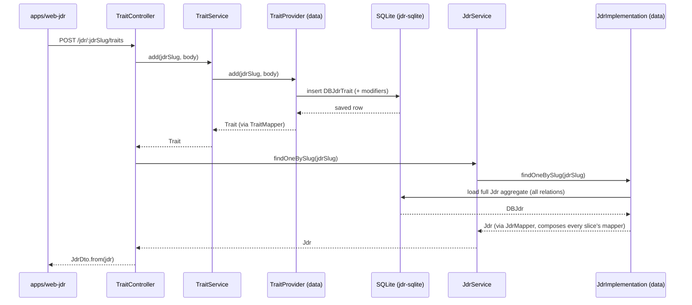
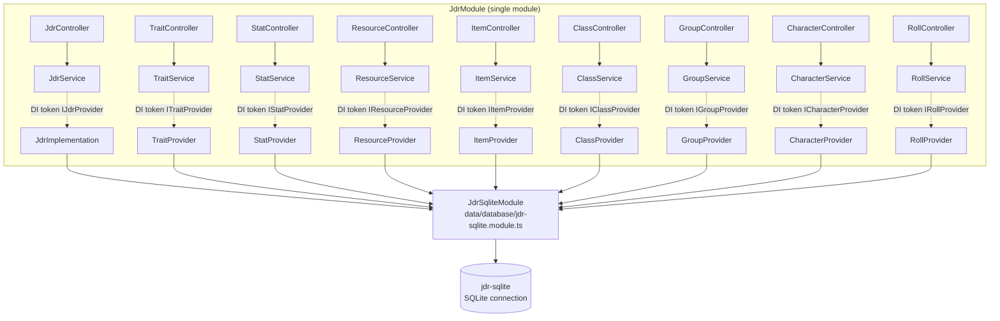

# `jdr` lib — architecture

The `jdr` library is organized as a single NestJS module (`JdrModule`) with a hexagonal
(ports & adapters) layering **flattened at the top level of the lib**, split by data type
("slice"). There is no module-per-slice, no `forwardRef`, and no separate `backend/` folder —
everything lives under exactly three top-level folders: `domain/`, `app/`, `data/`.

## The three layers

```
libs/jdr/src/lib/
  domain/<slice>/          <- the hexagon's core: framework-agnostic
    <Entity>.ts             entity (plain class/interface, no NestJS/TypeORM)
    <Entity>Service.ts       business logic, injects the port via DI token
    ports/I<Entity>Provider.ts   port interface (driven port), owned by domain

  app/<slice>/             <- entry point (driving adapter)
    <Entity>Controller.ts    HTTP controller for that data type
    dto/<Entity>Dto.ts        response DTO, `implements <Entity>`
    dto/<Entity>Requests.ts   request DTOs (class-validator decorated)

  data/<slice>/            <- persistence (driven adapter)
    database/DB<Entity>.ts   TypeORM entity (columns/relations only, no mapping logic)
    <Entity>Mapper.ts         DB row  -> domain entity conversion
    <Entity>Provider.ts       implements I<Entity>Provider using the repo + mapper

  jdr.module.ts            <- single composition root: wires every slice together
```

A slice's three folders never know about each other's *internals* — `app` depends on
`domain` (service + entity types), `data` depends on `domain` (port + entity types), and
`domain` depends on nothing NestJS/TypeORM-specific. Only `jdr.module.ts` wires the concrete
`data` provider to the `domain` port via a DI token (e.g. `'ITraitProvider' -> TraitProvider`).

## Slices

| Slice | Entity | Notes |
|---|---|---|
| `jdr` | `Jdr` (root aggregate) | Only owns root CRUD (`findAll`, `findOneBySlug`, `create`, `update`, `delete`). Composes the full `Jdr` by calling every other slice's mapper. |
| `traits` | `Trait` | Pilot slice — `Trait`/`TraitType` are plain interfaces (not classes). |
| `stats` | `Stat` | |
| `resources` | `Resource`, `GroupResourceValue` | |
| `items` | `Item`, `OwnedItem` (group-owned) | |
| `classes` | `JdrClass`, `ClassResourceProfile` | |
| `groups` | `JdrGroup` | |
| `characters` | `Character` (+ nested `CharacterStat`/`CharacterResource`/owned items) | Most complex slice: seeds stats/resources on creation, owns all character-scoped link tables. |
| `rolls` | `DiceRoll` | Needs the fully composed `Jdr` (via `JdrMapper`) to compute final stat values before rolling. |

## Why every mutation still returns the full `Jdr`

The frontend (`apps/web-jdr`) expects every mutation endpoint (add a trait, update a stat, ...)
to respond with the **entire recomposed `JdrDto`**, not just the mutated entity. Rather than
making every slice's provider reconstruct the whole aggregate, each slice keeps that
responsibility at the **controller** level:



Every other slice's controller (`StatController`, `ResourceController`, `ItemController`,
`ClassController`, `GroupController`, `CharacterController`) follows the exact same pattern.
`RollController` is the one exception: dice rolls return their own `DiceRollDto`, not the full
`JdrDto`, matching the pre-existing API contract.

## Module composition



There is a single `JdrModule` (`libs/jdr/src/lib/jdr.module.ts`). It imports one shared
`JdrSqliteModule` (registers every `DB*` entity across all slices on the same TypeORM
connection) and registers all 9 controllers/services/providers directly — no per-slice Nest
modules, so there's nothing to `forwardRef`.

`apps/api-jdr/src/main.ts` and `src/main/app-unified.module.ts` both import `JdrModule`
straight from the `jdr` package.

## Database schema

All tables live on the same SQLite connection (`jdr-sqlite`, registered once by
`data/database/jdr-sqlite.module.ts`). `jdr_*` is the root aggregate; every other table is
scoped to it via a `jdrSlug` column that's part of its composite primary key.

Two kinds of relationships appear below:
- **solid, real FK** — an actual TypeORM `@ManyToOne` + `@JoinColumn` (enforced, `onDelete: CASCADE`).
- **soft reference (no FK)** — the child table only stores the target's `slug` as a plain
  column (e.g. `statSlug`, `itemSlug`). There's no DB-level constraint; the mapper resolves it
  in application code. These are called out explicitly in the relationship label.

```mermaid
erDiagram
    JDR ||--o{ STAT : "real FK"
    JDR ||--o{ TRAIT : "real FK"
    JDR ||--o{ RESOURCE : "real FK"
    JDR ||--o{ GROUP_RESOURCE : "real FK"
    JDR ||--o{ ITEM : "real FK"
    JDR ||--o{ GROUP_ITEM : "real FK"
    JDR ||--o{ CHARACTER : "real FK"
    JDR ||--o{ JDR_CLASS : "real FK"
    JDR ||--o{ GROUP : "real FK"
    JDR ||--o{ DICE_ROLL : "jdrSlug column, no FK"

    TRAIT ||--o{ TRAIT_MODIFIER : "real FK"

    RESOURCE ||--o| GROUP_RESOURCE : "real FK (1:1, only if type=GROUP)"
    RESOURCE ||--o{ CHARACTER_RESOURCE : "soft ref by resourceSlug (M:N w/ CHARACTER)"
    RESOURCE ||--o{ CLASS_RESOURCE : "soft ref by resourceSlug (M:N w/ JDR_CLASS)"

    ITEM ||--o{ ITEM_MODIFIER : "real FK"
    ITEM ||--o| GROUP_ITEM : "real FK (1:1, group inventory qty)"
    ITEM ||--o{ CHARACTER_ITEM : "soft ref by itemSlug (M:N w/ CHARACTER)"

    JDR_CLASS ||--o{ CLASS_RESOURCE : "real FK"
    JDR_CLASS ||--o{ CHARACTER : "soft ref by classSlug (optional, 1:N)"

    GROUP ||--o{ CHARACTER_GROUP : "soft ref by groupSlug (M:N w/ CHARACTER)"

    STAT ||--o{ CHARACTER_STAT : "soft ref by statSlug (M:N w/ CHARACTER)"

    TRAIT ||--o{ CHARACTER_TRAIT : "soft ref by traitSlug (M:N w/ CHARACTER)"

    CHARACTER ||--o{ CHARACTER_STAT : "real FK"
    CHARACTER ||--o{ CHARACTER_TRAIT : "real FK"
    CHARACTER ||--o{ CHARACTER_ITEM : "real FK"
    CHARACTER ||--o{ CHARACTER_RESOURCE : "real FK"
    CHARACTER ||--o{ CHARACTER_GROUP : "real FK"

    JDR {
        varchar slug PK
        varchar name
        varchar text
    }
    STAT {
        varchar jdrSlug PK "FK -> JDR"
        varchar slug PK
        varchar name
    }
    TRAIT {
        varchar jdrSlug PK "FK -> JDR"
        varchar slug PK
        varchar name
        varchar type
        int level
        json data
    }
    TRAIT_MODIFIER {
        varchar jdrSlug PK "FK -> JDR"
        varchar traitSlug PK "FK -> TRAIT"
        varchar statSlug PK "soft ref, no FK"
        int value
    }
    RESOURCE {
        varchar jdrSlug PK "FK -> JDR"
        varchar slug PK
        varchar name
        varchar type "SINGLE | GROUP | ALL"
    }
    GROUP_RESOURCE {
        varchar jdrSlug PK "FK -> JDR"
        varchar resourceSlug PK "FK -> RESOURCE"
        int value
    }
    ITEM {
        varchar jdrSlug PK "FK -> JDR"
        varchar slug PK
        varchar name
        varchar description
        boolean unique
    }
    ITEM_MODIFIER {
        varchar jdrSlug PK "FK -> JDR"
        varchar itemSlug PK "FK -> ITEM"
        varchar statSlug PK "soft ref, no FK"
        int value
    }
    GROUP_ITEM {
        varchar jdrSlug PK "FK -> JDR"
        varchar itemSlug PK "FK -> ITEM"
        int quantity
    }
    JDR_CLASS {
        varchar jdrSlug PK "FK -> JDR"
        varchar slug PK
        varchar name
        varchar text
        int level
    }
    CLASS_RESOURCE {
        varchar jdrSlug PK "FK -> JDR"
        varchar classSlug PK "FK -> JDR_CLASS"
        varchar resourceSlug PK "soft ref, no FK"
        varchar resourceType
        int defaultValue
        varchar behavior "fixed | scalable"
    }
    GROUP {
        varchar jdrSlug PK "FK -> JDR"
        varchar slug PK
        varchar name
        varchar text
    }
    CHARACTER {
        varchar jdrSlug PK "FK -> JDR"
        varchar slug PK
        varchar name
        varchar classSlug "nullable, soft ref, no FK"
        int classLevel
        boolean isPlayable
        varchar text
    }
    CHARACTER_STAT {
        varchar jdrSlug PK "FK -> JDR"
        varchar characterSlug PK "FK -> CHARACTER"
        varchar statSlug PK "soft ref, no FK"
        int value
    }
    CHARACTER_TRAIT {
        varchar jdrSlug PK "FK -> JDR"
        varchar characterSlug PK "FK -> CHARACTER"
        varchar traitSlug PK "soft ref, no FK"
    }
    CHARACTER_ITEM {
        varchar jdrSlug PK "FK -> JDR"
        varchar characterSlug PK "FK -> CHARACTER"
        varchar itemSlug PK "soft ref, no FK"
        int quantity
    }
    CHARACTER_RESOURCE {
        varchar jdrSlug PK "FK -> JDR"
        varchar characterSlug PK "FK -> CHARACTER"
        varchar resourceSlug PK "soft ref, no FK"
        int value
    }
    CHARACTER_GROUP {
        varchar jdrSlug PK "FK -> JDR"
        varchar characterSlug PK "FK -> CHARACTER"
        varchar groupSlug PK "soft ref, no FK"
    }
    DICE_ROLL {
        uuid id PK
        varchar jdrSlug "no FK"
        varchar characterSlug "snapshot, no FK"
        varchar characterName "denormalized snapshot"
        varchar statSlug "snapshot, no FK"
        varchar statName "denormalized snapshot"
        int statValue "computed final value at roll time"
        varchar rollState "normal | advantage | disadvantage | double_advantage"
        boolean isArbitrary
        varchar formula "e.g. 2d6, arbitrary rolls only"
        simple-array results
        varchar text
        datetime createdDate
    }
```



Notable design points:
- **Many-to-many via join table + soft reference**: `CHARACTER_STAT`, `CHARACTER_TRAIT`,
  `CHARACTER_ITEM`, `CHARACTER_RESOURCE` and `CHARACTER_GROUP` are all M:N join tables between
  `CHARACTER` and their respective entity, but only the `CHARACTER` side is a real FK — the
  other side (`statSlug`, `traitSlug`, `itemSlug`, `resourceSlug`, `groupSlug`) is a plain
  string column resolved by the slice's mapper, not a DB constraint.
- **`GROUP_RESOURCE` / `GROUP_ITEM`** aren't tied to an actual `GROUP` entity — they represent
  the jdr's shared/group-wide pool (one row per `RESOURCE`/`ITEM`), hence the 1:1 cardinality.
- **`CHARACTER.classSlug`** is nullable and unenforced (no `@ManyToOne` in code) — a character
  may have no class, and deleting a class just nulls it out (`ClassProvider.remove`), it
  doesn't cascade-delete characters.
- **`DICE_ROLL`** denormalizes `characterName`/`statName` at roll time (a historical roll log
  should still read correctly even if the character/stat is later renamed or deleted) — it's
  intentionally not a live join.

## Conventions recap

- **Entities** live in `domain/<slice>/`. Only `Trait`/`TraitType` are pure interfaces so far
  (pilot slice); the rest (`Stat`, `Resource`, `Item`, `JdrClass`, `JdrGroup`, `Character`,
  `DiceRoll`, ...) are still classes with constructor-time validation (`Slug.assertValid`,
  `Guards`). Converting them to plain interfaces is tracked as follow-up work, not done in this
  pass to limit risk/scope.
- **Ports** (`I<Entity>Provider`) are interfaces in `domain/<slice>/ports/`, owned by the
  domain layer (dependency inversion — the data layer implements them, not the other way
  around).
- **DTOs** in `app/<slice>/dto/` are concrete classes that `implements` the domain entity
  shape and carry `class-validator`/Swagger decorators; they're what controllers actually
  accept/return.
- **Mappers** (`<Entity>Mapper.ts`) live in `data/<slice>/` as dedicated classes — DB entity
  classes (`DB<Entity>.ts`) only declare TypeORM columns/relations, they no longer carry
  `static toXxx()` conversion methods.
- Cross-cutting utilities (`Slug`, `Guards`, `JdrError`) live in `domain/shared/`, not inside
  any one slice.

## Récap

Vue textuelle de la structure des données, en partant de la racine `Jdr` :

- **`Jdr`** (aggrégat racine, identifié par son `slug`)
  - possède des **`Stat`** (les caractéristiques disponibles, ex. Force, Agilité)
  - possède des **`Trait`** (chacun avec ses **`TraitModifier`**, qui appliquent un bonus/malus à une `Stat`)
  - possède des **`Resource`** (ex. Points de vie, Mana), typées `SINGLE` / `GROUP` / `ALL`
    - une `Resource` de type `GROUP` a une **`GroupResourceValue`** (valeur partagée par le groupe)
  - possède des **`Item`** (chacun avec ses **`ItemModifier`**, comme les traits)
    - un `Item` peut avoir un **`OwnedItem`** au niveau du groupe (quantité en inventaire commun)
  - possède des **`JdrClass`** (classes de personnage)
    - chaque classe référence des `Resource` via **`ClassResourceProfile`** (valeur par défaut, comportement `fixed`/`scalable`)
  - possède des **`JdrGroup`** (groupes de personnages)
  - possède des **`Character`** (personnages), chacun :
    - peut appartenir à une **`JdrClass`** (référence souple par `classSlug`, optionnelle)
    - a ses propres valeurs de `Stat` (via `CharacterStat`)
    - a ses propres `Trait` (via `CharacterTrait`)
    - a ses propres `Item` en inventaire (via `CharacterItem`, avec quantité)
    - a ses propres valeurs de `Resource` (via `CharacterResource`)
    - appartient à un ou plusieurs `JdrGroup` (via `CharacterGroup`)
  - conserve un historique de **`DiceRoll`** (jets de dés), chacun figeant un instantané
    (nom du personnage, nom de la stat, valeur finale calculée) au moment du jet

En résumé : tout est rattaché au `Jdr`, les entités "catalogue" (`Stat`, `Trait`, `Resource`,
`Item`, `JdrClass`, `JdrGroup`) définissent les règles du jeu, et le `Character` vient piocher
dans ce catalogue pour construire son état propre (stats, traits, items, ressources, groupes).
